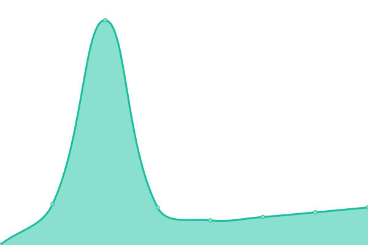
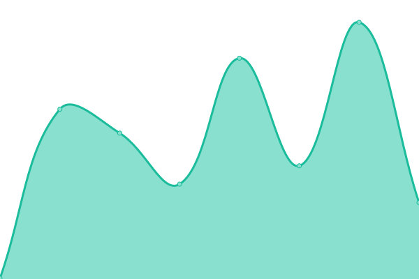

# Smithfield Status

This repository contains the open-source uptime monitor and status page for [Smithfield](https://smithfield.studio/), powered by [Upptime](https://github.com/upptime/upptime).

<!--start: status pages-->
<!-- This summary is generated by Upptime (https://github.com/upptime/upptime) -->
<!-- Do not edit this manually, your changes will be overwritten -->
<!-- prettier-ignore -->
| URL | Status | History | Response Time | Uptime |
| --- | ------ | ------- | ------------- | ------ |
|  [Smithfield](https://smithfield.studio) | 🟩 Up | [smithfield.yml](https://github.com/smithfield-studio/status/commits/HEAD/history/smithfield.yml) | 

 306ms
     
 | 

<a href="https://status.smithfield.studio/history/smithfield">100.00%</a>
    

|  [Change.org](https://changefoundation.org) | 🟩 Up | [change-org.yml](https://github.com/smithfield-studio/status/commits/HEAD/history/change-org.yml) | 

 1151ms
     
 | 

<a href="https://status.smithfield.studio/history/change-org">96.18%</a>
    

|  [Wooshii](https://wooshii.com) | 🟩 Up | [wooshii.yml](https://github.com/smithfield-studio/status/commits/HEAD/history/wooshii.yml) | 

 1229ms
     
 | 

<a href="https://status.smithfield.studio/history/wooshii">100.00%</a>
    

|  [Oneflow](https://oneflow.com) | 🟩 Up | [oneflow.yml](https://github.com/smithfield-studio/status/commits/HEAD/history/oneflow.yml) | 

 1225ms
     
 | 

<a href="https://status.smithfield.studio/history/oneflow">100.00%</a>
    

|  [WWF Planet-Based Diets](https://planetbaseddiets.panda.org) | 🟩 Up | [wwf-planet-based-diets.yml](https://github.com/smithfield-studio/status/commits/HEAD/history/wwf-planet-based-diets.yml) | 

 295ms
     
 | 

<a href="https://status.smithfield.studio/history/wwf-planet-based-diets">100.00%</a>
    

|  [AFRIpads](https://www.afripads.com) | 🟩 Up | [afr-ipads.yml](https://github.com/smithfield-studio/status/commits/HEAD/history/afr-ipads.yml) | 

 764ms
     
 | 

<a href="https://status.smithfield.studio/history/afr-ipads">100.00%</a>
    

|  [Kindness](https://kindness.org) | 🟩 Up | [kindness.yml](https://github.com/smithfield-studio/status/commits/HEAD/history/kindness.yml) | 

 97ms
     
 | 

<a href="https://status.smithfield.studio/history/kindness">100.00%</a>
    

<!--end: status pages-->
